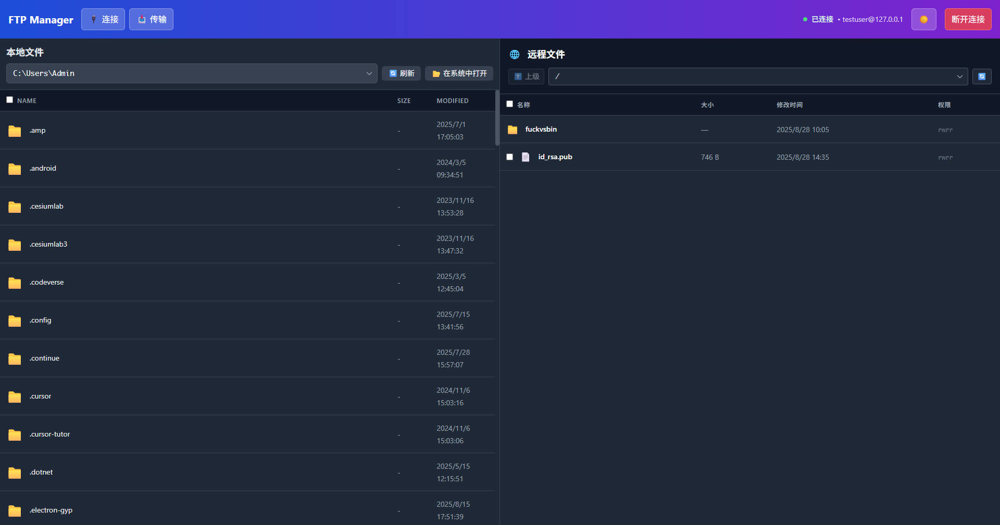

# FTP Manager - 现代化文件传输工具

一个使用 Electron + React + TypeScript 构建的现代化 FTP 文件管理工具，类似 FileZilla 的功能。



## 功能特性

### 🔌 连接管理

- 支持 FTP 和 SFTP 协议
- 连接状态实时显示
- 安全的凭据管理

### 📁 文件浏览

- 双面板设计（本地文件 + 远程文件）
- 文件和文件夹图标显示
- 文件大小和修改时间
- 多选支持

### 📤 文件传输

- 拖拽上传支持
- 传输队列管理
- 实时进度显示
- 传输状态跟踪（待传输、传输中、已完成、失败）
- 失败重试和已完成清理

### 🎨 现代化界面

- 响应式设计
- 直观的用户体验
- 清晰的状态指示
- 专业的视觉设计

## 界面组件

### 1. 连接界面

- 协议选择（FTP/SFTP）
- 服务器配置（主机、端口、用户名、密码）
- 连接状态反馈

### 2. 文件浏览器

- **左侧面板**: 本地文件系统
- **中间控制区**: 上传/下载按钮
- **右侧面板**: 远程服务器文件

### 3. 传输队列

- 当前传输项目列表
- 进度条显示
- 传输统计信息

## 技术栈

- **框架**: Electron + React 19
- **语言**: TypeScript
- **样式**: 自定义CSS（类似TailwindCSS风格）
- **构建工具**: Vite + electron-vite

## 开发环境

```bash
# 安装依赖
npm install

# 启动开发服务器
npm run dev

# 构建应用
npm run build

# 打包应用
npm run build:win   # Windows
npm run build:mac   # macOS
npm run build:linux # Linux
```

## 项目结构

```
src/
├── main/           # Electron 主进程
├── preload/        # 预加载脚本
└── renderer/       # React 渲染进程
    └── src/
        ├── components/
        │   ├── FTPManager.tsx      # 主应用组件
        │   ├── FTPConnection.tsx   # 连接界面
        │   ├── FileExplorer.tsx    # 文件浏览器
        │   └── FileTransfer.tsx    # 传输队列
        ├── assets/
        └── App.tsx
```

## 界面预览

### 连接界面

- 简洁的连接表单
- 协议选择和服务器配置
- 连接状态反馈

### 主界面

- 三列布局：本地文件 | 传输控制 | 远程文件
- 文件列表显示文件类型图标、大小、修改时间
- 传输队列实时显示传输进度

## 后续开发计划

1. **实际FTP功能**: 集成真实的FTP/SFTP客户端库
2. **文件操作**: 重命名、删除、新建文件夹
3. **书签管理**: 保存常用服务器连接
4. **传输优化**: 断点续传、并发传输
5. **安全增强**: 密钥认证、SSL/TLS支持

---

这个项目展示了现代Web技术在桌面应用开发中的应用，提供了专业的FTP客户端界面和用户体验。

## 自动构建与发布（GitHub Actions）

本仓库包含一个 GitHub Actions workflow (`.github/workflows/ci-release.yml`)，用于在创建 tag（例如 `v1.0.0`）或发布 Release 时自动构建并打包应用。默认会在 Ubuntu、Windows、macOS 三个平台上运行构建并上传构建产物到 workflow artifacts，随后由 Release 步骤将构建产物发布到 GitHub Releases。

需要在仓库的 Secrets 中配置以下变量（通过 Settings → Secrets → Actions 添加）：

- `GITHUB_TOKEN`：Actions 自动提供，通常不需要手动设置。用于创建 Release。
- `CSC_LINK`：可选，代码签名证书的远程下载链接（用于 macOS/Windows 签名）。
- `CSC_KEY_PASSWORD`：可选，代码签名证书密码。

如何触发发布：

- 通过推送 tag（例如 `git tag v1.0.0 && git push origin v1.0.0`）触发自动构建并执行 Release 步骤。
- 也可以在 GitHub 上手动创建 Release（发布类型为 `published` 时也会触发）。

注意事项：

- 如果需要自动签名 macOS 或 Windows 应用，请准备好签名证书并使用 `CSC_LINK`/`CSC_KEY_PASSWORD` 或 GitHub Actions 适配的签名方法。
- workflow 文件简单示例放在 `.github/workflows/ci-release.yml`，可按需修改：构建平台、artifact 路径、打包参数等。
